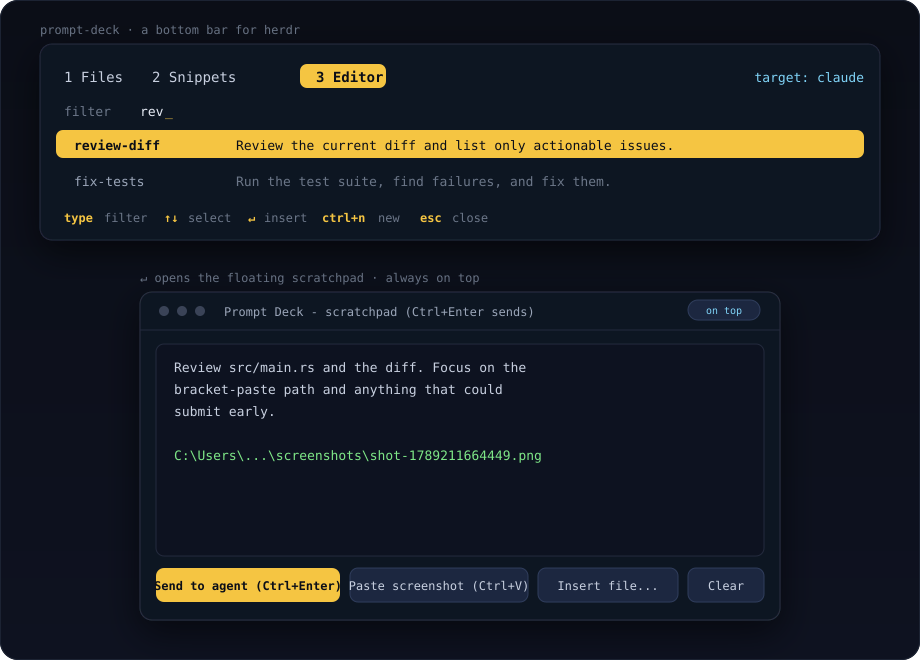

# Prompt Deck

**Stage your next prompt — file paths, snippets, screenshots, long drafts — then hit
Enter yourself.**

[](https://github.com/matdac12/herdr-prompt-deck/actions/workflows/ci.yml)
[](https://github.com/matdac12/herdr-prompt-deck/releases)
[](LICENSE)
[](#platform-support)
[](https://herdr.dev)

<p align="center">
  
</p>

Prompt Deck is a [Herdr](https://herdr.dev) plugin: a slim bar at the bottom of your
tab that drops things into the focused coding agent's prompt **without submitting**.
Stack a file path, a saved snippet, a screenshot, and a long scratchpad draft — then
press Enter yourself.

Works with Claude Code, OpenCode, Codex, or anything else running in a Herdr pane.

## Why

- **Stop retyping paths and prompts.** A file picker, a searchable snippet library,
  and a screenshot shortcut, always one key away.
- **Long prompts need room.** The Editor opens a persistent, always-on-top window so
  you can write over any app and send when you're ready.
- **Nothing auto-submits.** Prompt Deck only ever inserts text — you stay in control
  of when the agent actually runs.
- **Your data is plain files.** Snippets and the scratchpad are hand-editable TOML and
  Markdown in your config dir.

## Tools

| Tool | What it does |
| --- | --- |
| **Files** | Opens your real OS file dialog, then inserts the file's absolute path. |
| **Snippets** | A searchable library of prompts you reuse, backed by `snippets.toml`. |
| **Editor** | A floating, always-on-top scratchpad window (Windows) with a file picker and screenshot paste. |

Everything is inserted into the agent's input, never submitted, so you can stack a
path and two snippets and then hit Enter yourself.

## Install

```sh
herdr plugin install matdac12/herdr-prompt-deck
```

The installer downloads a prebuilt binary for your OS and verifies its SHA-256, so you
do **not** need Rust. If no prebuilt matches your platform and version, it falls back
to building from source (needs a Rust toolchain).

Then bind a key in your Herdr `config.toml`.

**Windows** (action ids carry a `-windows` suffix):

```toml
[[keys.command]]
key = "prefix+p"
type = "plugin_action"
command = "prompt-deck.toggle-windows"
description = "toggle prompt deck"
```

**macOS / Linux**:

```toml
[[keys.command]]
key = "prefix+p"
type = "plugin_action"
command = "prompt-deck.toggle"
description = "toggle prompt deck"
```

> `prefix+p` is Herdr's default for *previous tab*. Pick a different key if you use
> that binding.

Reload the config with `prefix+shift+r`, or run `herdr server reload-config`.

## Keys

| Key | Action |
| --- | --- |
| `1` `2` `3` | switch tool (also `tab` / `shift+tab`) |
| `esc` | close the bar and return focus to the agent |

**Files**

| Key | Action |
| --- | --- |
| `b` | open the OS file dialog, insert the absolute path |

**Snippets**

| Key | Action |
| --- | --- |
| *(type)* | filter by name or text |
| `↑` `↓` | move selection |
| `↵` | insert the selected snippet |
| `ctrl+n` | new snippet |
| `ctrl+e` | edit the selected snippet |
| `ctrl+d` | delete the selected snippet |
| `tab` *(in the form)* | switch between name and text |
| `ctrl+s` *(in the form)* | save |

**Editor**

Press `↵` on the Editor tab to open the floating scratchpad.

| Key (in the window) | Action |
| --- | --- |
| `Ctrl+Enter` | send the text into the target agent prompt |
| `Ctrl+O` | open the native file dialog and insert the file's path |
| `Ctrl+V` | paste a clipboard screenshot: saves a PNG and inserts its path (normal text paste otherwise) |
| *(buttons)* | **Send to agent** / **Paste screenshot** / **Insert file...** / **Clear** |

On **Windows** the window is Prompt Deck's own always-on-top editor: type or paste
over any app, press `Ctrl+O` for paths, `Ctrl+V` for screenshots, then `Ctrl+Enter` to
send. Press `↵` in the deck again to raise the existing window instead of opening
another. On **macOS / Linux** the OS editor is used instead (`$VISUAL` / `$EDITOR`,
else `open -e` / `xdg-open`): edit and save `scratch.md`, then press `s` on the Editor
tab to send it to the agent.

## Screenshots

Grab a region with **Win+Shift+S**, then press `Ctrl+V` in the scratchpad — the PNG is
saved under the plugin config dir and its path is dropped into your prompt, ready for
the agent to open.

## How insertion works

Insertion is always `herdr pane send-text`, never Enter. Multi-line content (snippets,
the scratchpad) is wrapped in **bracketed-paste** markers so its newlines don't submit
either — it lands as multiple lines in the prompt. This relies on the target app
supporting bracketed paste, which modern coding agents and shells do.

The bar opens as a slim split at the bottom of the current pane, targets the agent you
were last focused on, and gets out of the way when you press `esc`.

## Config files

All under Herdr's plugin config directory:

- **Windows**: `%APPDATA%\herdr\plugins\config\prompt-deck\`
- **macOS / Linux**: `~/.config/herdr/plugins/config/prompt-deck/`

```toml
# snippets.toml — rewritten when you add, edit, or delete from the Snippets tab
[[snippet]]
name = "review-diff"
text = "Review the current diff and list only actionable issues."

[[snippet]]
name = "fix-tests"
text = "Run the test suite, find failures, and fix them."
```

- `scratch.md` — the scratchpad buffer; edited in the floating window, kept on close.
- `screenshots/` — PNGs saved from clipboard pastes.

Keep `snippets.toml` as the single source of truth rather than editing it while the
bar is open.

## Platform support

Developed and tested on **Windows**. macOS and Linux binaries are built in CI and the
launcher logic is shared Rust code, but the Unix path has not yet been exercised
against a live Herdr server — reports and fixes welcome.

The file picker uses the native OS dialog on Windows and macOS. On Linux there is no
in-process dialog, so Prompt Deck calls `zenity` (GNOME) or `kdialog` (KDE); install
one of them or the Files tool will report that no dialog is available.

## Development

```sh
git clone https://github.com/matdac12/herdr-prompt-deck
cd herdr-prompt-deck
cargo build --release
herdr plugin link .
```

`herdr plugin link` registers the working directory as a local plugin (it does not run
the build for you). After changing code, `cargo build --release` and the next toggle
picks up the new binary. Tests: `cargo test`.

## Releases

Push a tag matching the version in `Cargo.toml` and `herdr-plugin.toml` (e.g. `v0.1.0`)
and the release workflow builds binaries for macOS (arm64 + x86_64), Linux (x86_64,
static musl), and Windows (x86_64), publishing them with a `SHA256SUMS` file. The
installer picks the right asset.

## License

[MIT](LICENSE)

---

If Prompt Deck saves you time, a star helps other Herdr users find it.
